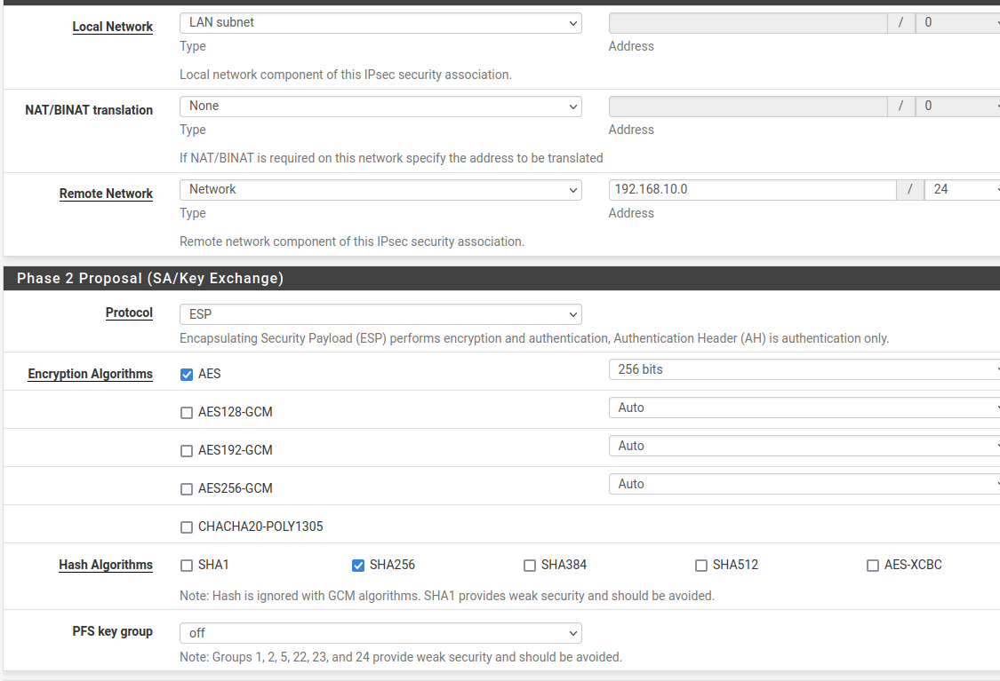

# Setting up IPsec Site-to-Site VPN with StrongSwan and pfSense

This guide will walk you through the process of setting up an IPsec site-to-site VPN environment using StrongSwan and pfSense. The environment will consist of two VPN gateways connected via an IPsec tunnel, allowing secure communication between them. Additionally, client devices will be configured within the local network of each gateway for testing purposes.

## 1. Setting up pfSense

### Network Interface Settings
Start by configuring the network interfaces on pfSense according to your network setup.

### Phase 1 Settings
Configure Phase 1 settings for IPsec IKE endpoints, including authentication and encryption methods.

### Phase 1 Expiration and Replacement
Define expiration and replacement settings for Phase 1.

### Phase 2 Settings
Configure Phase 2 settings for IPsec, including encryption algorithms and lifetimes.

### Firewall Rules
Set up firewall rules to allow traffic from StrongSwan to pass through the IPsec tunnel.

## 2. Setting up StrongSwan Gateway

### ipsec.conf Configuration
Configure StrongSwan settings in the `ipsec.conf` file.

### ipsec.secrets Configuration
Set up pre-shared keys for communication between StrongSwan and pfSense in the `ipsec.secrets` file.

### Kernel Parameter Configuration
Configure kernel parameters for packet forwarding and NAT by adding the necessary commands to the `sysctl.conf` file.

## 3. Testing

### Verify Tunnel Status
Start the StrongSwan service and verify that the IPsec tunnel is established. The status on pfSense should show "ESTABLISHED."

### Test Connectivity
Use ping utilities to test the reachability of virtual machines across the VPN tunnel.

### Packet Capture
Capture packets using Wireshark to analyze the traffic flowing through the VPN tunnel.

By following these steps, you have successfully set up and tested an IPsec site-to-site VPN environment using StrongSwan and pfSense. This environment provides secure communication between remote networks, making it suitable for various networking scenarios.
